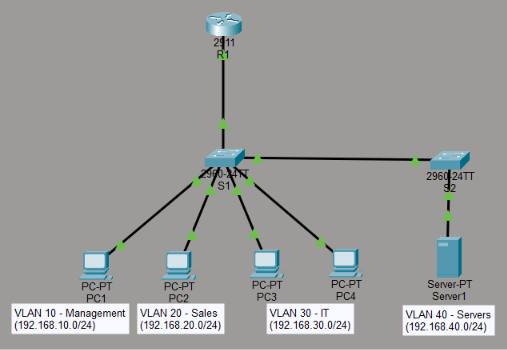

# TechFlow Solutions - Small Business Network

## Project Overview
This project simulates a complete small business network for TechFlow Solutions using Cisco Packet Tracer. The network segments three departments (Management, Sales, IT) using VLANs, routes between them with Router-on-a-Stick, automates IP assignment with DHCP, and enforces security policies with Access Control Lists.

## Network Diagram

## Technologies Used
- **VLANs** - Network segmentation for department isolation
- **802.1Q Trunking** - Carrying multiple VLANs over a single link
- **Router-on-a-Stick** - Inter-VLAN routing using subinterfaces
- **DHCP** - Automatic IP address assignment
- **Access Control Lists (ACLs)** - Traffic filtering and security enforcement
- **Cisco Packet Tracer** - Network simulation environment

## IP Addressing Scheme
| VLAN | Department | Subnet | Gateway |
|------|------------|--------|---------|
| 10 | Management | 192.168.10.0/24 | 192.168.10.1 |
| 20 | Sales | 192.168.20.0/24 | 192.168.20.1 |
| 30 | IT | 192.168.30.0/24 | 192.168.30.1 |

See [docs/ip-addressing-table.md](docs/ip-addressing-table.md) for the complete device addressing table.

## Key Configurations
- **Router R1**: Three subinterfaces (G0/0.10, G0/0.20, G0/0.30) with 802.1Q encapsulation for inter-VLAN routing
- **Switch S1**: VLANs 10, 20, 30 with access ports assigned per department; trunk link to R1 on G0/1
- **DHCP**: Three pools (MGMT-POOL, SALES-POOL, IT-POOL) with first 10 addresses excluded for static devices
- **Security**: Unused ports shut down and assigned to VLAN 99 (ParkingLot)

## Security Implementation
- Extended ACL 100 blocks Sales (VLAN 20) from accessing Management (VLAN 10)
- ACL applied inbound on G0/0.20 (close to source - Cisco best practice)
- All unused switch ports disabled and moved to a parking lot VLAN
- Password encryption enabled on all devices

## Testing Results
| Test | Source | Destination | Result |
|------|--------|-------------|--------|
| Same VLAN | PC3 (IT) | PC4 (IT) | PASS |
| Inter-VLAN allowed | PC1 (Mgmt) | PC2 (Sales) | PASS |
| ACL block | PC2 (Sales) | PC1 (Mgmt) | BLOCKED |
| ACL allow other | PC2 (Sales) | PC3 (IT) | PASS |

See [docs/test-results.md](docs/test-results.md) for detailed test documentation.

## 🚀 Network Expansion & Security Update (Secret Mission)

To simulate a realistic, scaling enterprise network, the topology has been expanded beyond a single switch to include a dedicated server segment and a multi-switch campus backbone.

### Key Enhancements:
*   **Multi-Switch Campus Infrastructure**: Added a second Catalyst 2960 switch (**S2**) connected to **S1** via a high-speed **GigabitEthernet trunk link** (802.1Q). This backbone aggregation allows VLAN traffic to transition seamlessly between physical switches.
*   **Dedicated Server Segment (VLAN 40)**: Created an isolated subnet (**192.168.40.0/24**) to host **Server1** (Static IP: `192.168.40.100`), representing corporate databases and centralized management services.
*   **Advanced Traffic Control via Extended ACLs**: Implemented **ACL 110** applied outbound on router **R1**'s `GigabitEthernet0/0.40` subinterface to establish strict management boundaries.

### Security Policies Enforced:
1.  **IT Management Only**: Only hosts originating from the **IT Subnet (VLAN 30)** are permitted to establish remote administrative sessions (**SSH on TCP Port 22**) to the server segment.
2.  **Unauthorized Access Dropped**: All other networks (Sales/VLAN 20 and Management/VLAN 10) are explicitly blocked from initiating SSH traffic to Server1 (resulting in connection timeouts).
3.  **Diagnostic Path Open**: General IP traffic (such as ICMP Pings) remains permitted across all VLANs to allow seamless network diagnostics and connection verification.

## What I Learned
- How to design an IP addressing scheme using private address space
- How VLANs segment broadcast domains and improve security
- How Router-on-a-Stick uses subinterfaces and 802.1Q to route between VLANs
- How to scale networks beyond a single switch using inter-switch trunking (802.1Q)
- How DHCP automates IP assignment across multiple subnets
- How extended ACLs filter traffic based on source, destination, and Layer 4 protocols (such as TCP Port 22 for SSH)
- How to troubleshoot and diagnose packet flows, specifically the critical logic of inbound vs. outbound ACL placement on subinterfaces
- The importance of network documentation for troubleshooting and collaboration